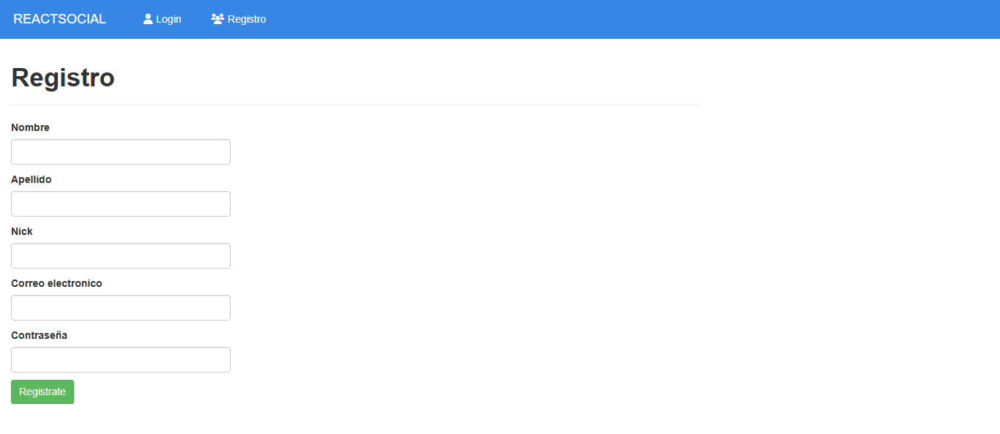
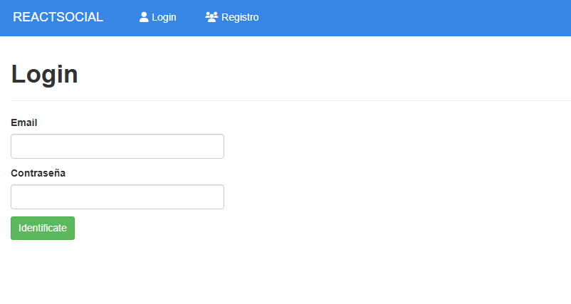
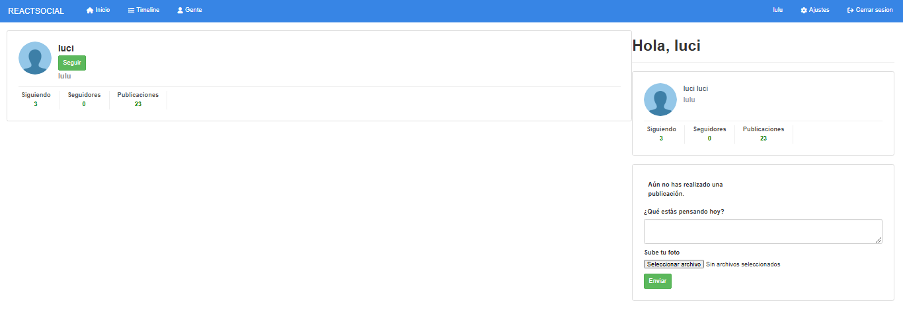
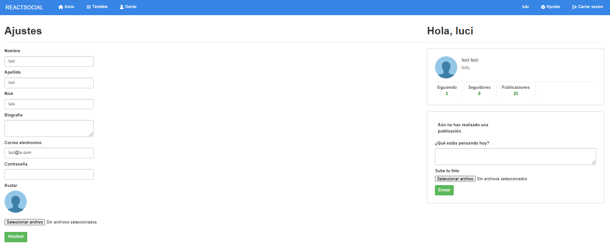

# Red Social-Frontend 👥

El frontend de la red social está construido con React y ofrece una experiencia intuitiva y funcional para los usuarios.

## Tabla de Contenidos

- [Características](#caracteristicas)
- [Tecnologías](#tecnologias)
- [Instalación](#instalacion)
- [Interfaz](#interfaz)
- [Despliegue](#despliegue)
- [Contacto](#contacto)

## Características 💬 <a id="caracteristicas"></a>

- Estilos CSS personalizados para lograr un diseño atractivo y funcional. 📲

- Configuración de rutas y layouts para organizar las vistas. 📰

- Rutas anidadas protegidas en la parte privada de la aplicación. 🔒

- Formulario de registro y login con validaciones personalizadas mediante hooks. 📄

- Gestión de datos del formulario, serialización y envío al backend. 📪

- Identificación de usuarios mediante tokens JWT. 👥

- Protección de rutas privadas para restringir el acceso si el usuario no está autenticado. 🔐

- Función de cerrar sesión del usuario. 💁

- Listado de usuarios, con opciones para seguir o dejar de seguir usuarios. 🔁

- Abstracción del listado de usuarios para reutilizar componentes en diferentes secciones. 📥

- Visualización de publicaciones, incluyendo imágenes asociadas. 📰

## Tecnologías 🌐 <a id="tecnologias"></a>

- **React**: Biblioteca principal para construir la interfaz de usuario.

- **Vite**: Herramienta de desarrollo rápido y eficiente para aplicaciones React.

## Instalación ⚙️ <a id="instalacion"></a>

Antes de instalar, descargue e instale Node.js. ☑️

1. Clona el repositorio:

```bash
  git clone https://github.com/freya-godoy/Red-Social-Backend.git
```

2. Instala dependencias del proyecto:

```sh
npm install
```

3. Iniciar el servidor de desarrollo:

```sh
npm run dev
```

Esta plantilla proporciona una configuración mínima para que React funcione en Vite con HMR y algunas reglas de ESLint. ☑️

- [@vitejs/plugin-react](https://github.com/vitejs/vite-plugin-react/blob/main/packages/plugin-react/README.md) uses [Babel](https://babeljs.io/) for Fast Refresh
- [@vitejs/plugin-react-swc](https://github.com/vitejs/vite-plugin-react-swc) uses [SWC](https://swc.rs/) for Fast Refresh

## Interfaz 📲 <a id="interfaz"></a>

Registro 📁



Login 👤



Perfil 👩



Social 💬


Ajustes 🔧



## Despliegue 📂 <a id="despliegue"></a>

Despliegue desde la consola:

Backend

```sh
npm start
```

Frontend

```sh
npm run dev
```

## Contribuciones 👇

¡Las contribuciones son bienvenidas! Sigue estos pasos:

1. Haz un fork del repositorio.
2. Crea una rama nueva: `git checkout -b nueva-rama`
3. Realiza tus cambios y haz un commit: `git commit -m "Descripción"`
4. Sube los cambios: `git push origin nueva-rama`
5. Abre un Pull Request.

## Contacto 📬 <a id="contacto"></a>

- Email: freya.godoy.20@hotmail.com
